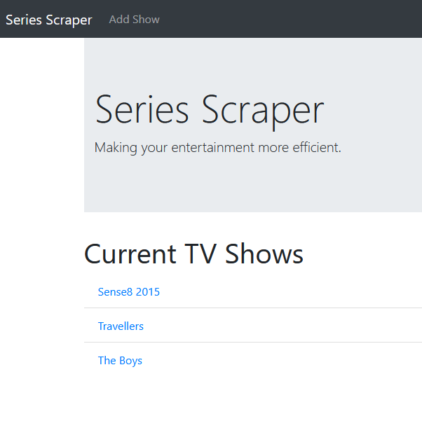

# Series Scraper

> Ruby Project to help you keep updated on your favourite TV Shows! It will also include an API with scraped results.

Additional description about the project and its features.

## Built With

- Ruby On Rails
- VSCode

## Live Demo

[Live Demo Link](https://series-scraper.herokuapp.com/)

## Getting Started

**Visit the page!**

## Authors

👤 **Shingirayi Mandebvu**

- Github: [@simandebvu](https://github.com/simandebvu)
- Twitter: [@simandebvu](https://twitter.com/simandebvu)
- Linkedin: [linkedin](https://linkedin.com/in/simandebvu)

## 🤝 Contributing

Contributions, issues and feature requests are welcome!

Feel free to check the [issues page](issues/).

## Show your support

Give a ⭐️ if you like this project!

## Acknowledgments

- Hat tip to anyone whose code was used
- Inspiration
- etc

## 📝 License

This project is [MIT](lic.url) licensed.